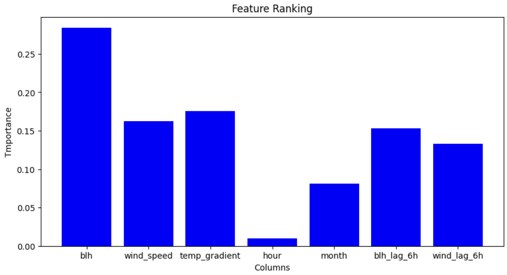
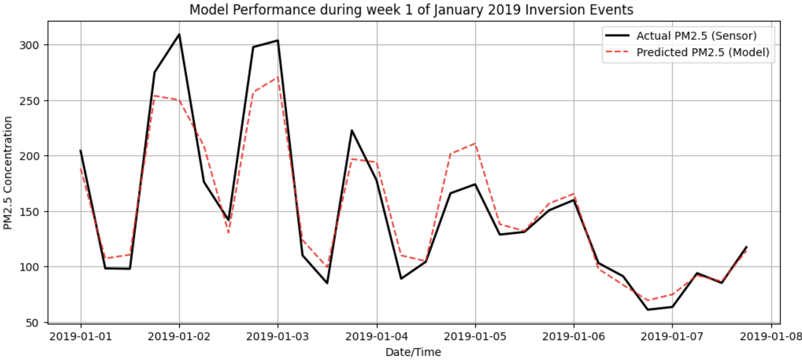
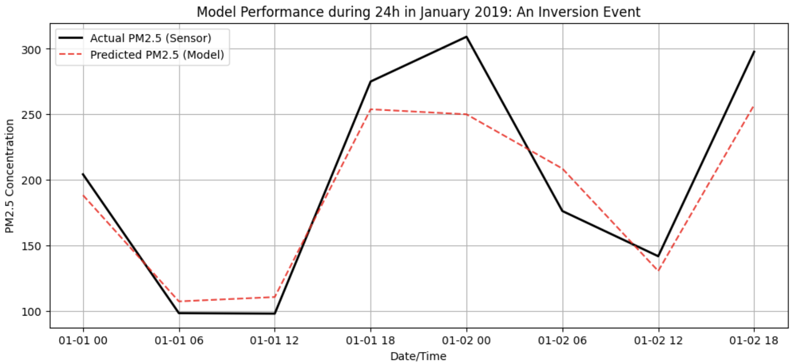

# GlobeX

### I built a Machine Learing model to predict urban air entrapment using atmospheric variables.

### While the model achieved an 86% $R^2$ in normal years, it failed during the 2020 lockdown, proving that weather only traps what humans emit.

  
   
  <em>Feature Importance</em>

  
   
  <em>Model Performance</em>

  
   
  <em>Temperature Inversion</em>

